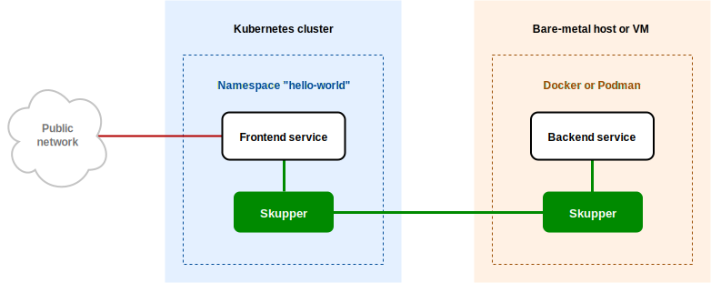

# Skupper Hello World using Podman

#### Connect services running as Podman containers

This example is part of a [suite of examples][examples] showing the
different ways you can use [Skupper][website] to connect services
across cloud providers, data centers, and edge sites.

[website]: https://skupper.io/
[examples]: https://skupper.io/examples/index.html

#### Contents

* [Overview](#overview)
* [Prerequisites](#prerequisites)
* [Step 1: Install the Skupper command-line tool](#step-1-install-the-skupper-command-line-tool)
* [Step 2: Set up your Kubernetes namespace](#step-2-set-up-your-kubernetes-namespace)
* [Step 3: Set up your Podman network](#step-3-set-up-your-podman-network)
* [Step 4: Deploy the frontend and backend](#step-4-deploy-the-frontend-and-backend)
* [Step 5: Create your sites](#step-5-create-your-sites)
* [Step 6: Link your sites](#step-6-link-your-sites)
* [Step 7: Expose the backend](#step-7-expose-the-backend)
* [Step 8: Access the frontend](#step-8-access-the-frontend)
* [Cleaning up](#cleaning-up)
* [Summary](#summary)
* [Next steps](#next-steps)
* [About this example](#about-this-example)

## Overview

This example is a basic multi-service HTTP application deployed
across a Kubernetes cluster and a bare-metal host or VM running
Podman containers.

It contains two services:

* A backend service that exposes an `/api/hello` endpoint.  It
  returns greetings of the form `Hi, <your-name>.  I am <my-name>
  (<container>)`.

* A frontend service that sends greetings to the backend and
  fetches new greetings in response.

With Skupper, you can run the backend as a container on your local
machine and the frontend in Kubernetes and maintain connectivity
between the two services without exposing the backend to the public
internet.

<!--  -->

## Prerequisites

* A working installation of Podman ([installation
  guide][install-podman])

* The `kubectl` command-line tool, version 1.15 or later
  ([installation guide][install-kubectl])

* Access to a Kubernetes cluster, from [any provider you
  choose][kube-providers]

[install-podman]: https://podman.io/getting-started/installation
[install-kubectl]: https://kubernetes.io/docs/tasks/tools/install-kubectl/
[kube-providers]: https://skupper.io/start/kubernetes.html

## Step 1: Install the Skupper command-line tool

This example uses the Skupper command-line tool to deploy Skupper.
You need to install the `skupper` command only once for each
development environment.

On Linux or Mac, you can use the install script (inspect it
[here][install-script]) to download and extract the command:

~~~ shell
curl https://skupper.io/install.sh | sh
~~~

The script installs the command under your home directory.  It
prompts you to add the command to your path if necessary.

For Windows and other installation options, see [Installing
Skupper][install-docs].

[install-script]: https://github.com/skupperproject/skupper-website/blob/main/input/install.sh
[install-docs]: https://skupper.io/install/

## Step 2: Set up your Kubernetes namespace

Open a new terminal window and log in to your cluster.  Then
create the namespace you wish to use and set the namespace on your
current context.

**Note:** The login procedure varies by provider.  See the
documentation for your chosen providers:

* [Minikube](https://skupper.io/start/minikube.html#cluster-access)
* [Amazon Elastic Kubernetes Service (EKS)](https://skupper.io/start/eks.html#cluster-access)
* [Azure Kubernetes Service (AKS)](https://skupper.io/start/aks.html#cluster-access)
* [Google Kubernetes Engine (GKE)](https://skupper.io/start/gke.html#cluster-access)
* [IBM Kubernetes Service](https://skupper.io/start/ibmks.html#cluster-access)
* [OpenShift](https://skupper.io/start/openshift.html#cluster-access)

_**Kubernetes:**_

~~~ shell
# Enter your provider-specific login command
kubectl create namespace hello-world
kubectl config set-context --current --namespace hello-world
~~~

## Step 3: Set up your Podman network

Open a new terminal window and set the `SKUPPER_PLATFORM`
environment variable to `podman`.  This sets the Skupper platform
to Podman for this terminal session.

Use `podman network create` to create the Podman network that
Skupper will use.

Use `systemctl` to enable the Podman API service.

_**Podman:**_

~~~ shell
export SKUPPER_PLATFORM=podman
podman network create skupper
systemctl --user enable --now podman.socket
~~~

If `systemctl` is not available, you can also use the following command:

~~~
podman system service --time=0 unix://$XDG_RUNTIME_DIR/podman/podman.sock &
~~~

## Step 4: Deploy the frontend and backend

This example runs the frontend in Kubernetes and the backend as
a local Podman container.

In Kubernetes, use `kubectl create deployment` to deploy the
frontend service in namespace `hello-world`.

In Podman, use `podman run` to start the backend service on your
local machine.

**Note:** It is important to name your running container using
`--name` to avoid a collision with the container that Skupper
creates for accessing the service.

**Note:** You must use `--network skupper` with the `podman run`
command.

_**Kubernetes:**_

~~~ shell
kubectl create deployment frontend --image quay.io/skupper/hello-world-frontend
~~~

_**Podman:**_

~~~ shell
podman run --name backend-target --network skupper --detach --rm -p 8080:8080 quay.io/skupper/hello-world-backend
~~~

## Step 5: Create your sites

A Skupper _site_ is a location where components of your
application are running.  Sites are linked together to form a
Skupper network for your application.

In Kubernetes, use `skupper init` to create a site.  This
deploys the Skupper router and controller.  Then use `skupper
status` to see the outcome.

In Podman, use `skupper init` with the option `--ingress none`
and use `skupper status` to see the result.

**Note:** If you are using Minikube, you need to [start minikube
tunnel][minikube-tunnel] before you run `skupper init`.

[minikube-tunnel]: https://skupper.io/start/minikube.html#running-minikube-tunnel

_**Kubernetes:**_

~~~ shell
skupper init
~~~

_Sample output:_

~~~ console
$ skupper init
Waiting for LoadBalancer IP or hostname...
Waiting for status...
Skupper is now installed in namespace 'hello-world'.  Use 'skupper status' to get more information.
~~~

_**Podman:**_

~~~ shell
skupper init --ingress none
~~~

_Sample output:_

~~~ console
$ skupper init --ingress none
It is recommended to enable lingering for jross, otherwise Skupper may not start on boot.
Skupper is now installed for user 'jross'.  Use 'skupper status' to get more information.
~~~

As you move through the steps below, you can use `skupper status` at
any time to check your progress.

## Step 6: Link your sites

Creating a link requires use of two `skupper` commands in
conjunction, `skupper token create` and `skupper link create`.

The `skupper token create` command generates a secret token that
signifies permission to create a link.  The token also carries the
link details.  Then, in a remote site, The `skupper link
create` command uses the token to create a link to the site
that generated it.

**Note:** The link token is truly a *secret*.  Anyone who has the
token can link to your site.  Make sure that only those you trust
have access to it.

First, use `skupper token create` in site Kubernetes to generate the
token.  Then, use `skupper link create` in site Podman to link
the sites.

_**Kubernetes:**_

~~~ shell
skupper token create ~/secret.token
~~~

_Sample output:_

~~~ console
$ skupper token create ~/secret.token
Token written to ~/secret.token
~~~

_**Podman:**_

~~~ shell
skupper link create ~/secret.token
~~~

_Sample output:_

~~~ console
$ skupper link create ~/secret.token
Site configured to link to https://10.105.193.154:8081/ed9c37f6-d78a-11ec-a8c7-04421a4c5042 (name=link1)
Check the status of the link using 'skupper link status'.
~~~

If your terminal sessions are on different machines, you may need
to use `scp` or a similar tool to transfer the token securely.  By
default, tokens expire after a single use or 15 minutes after
creation.

## Step 7: Expose the backend

We now have our sites linked to form a Skupper network, but no
services are exposed on it.  We can use the `skupper service`
commands to expose the backend service in Podman to the frontend
in Kubernetes.

In Kubernetes, use `skupper service create` to create a service
called `backend`.

In Podman, use `skupper service create` to create the same
service.  Use `skupper service bind` to attach your running
backend process as a target for the service.

**Note:** Podman sites do not automatically replicate services
to remote sites.  You need to use `skupper service create` on
each site where you wish to make a service available.

_**Kubernetes:**_

~~~ shell
skupper service create backend 8080
~~~

_**Podman:**_

~~~ shell
skupper service create backend 8080
skupper service bind backend host backend-target --target-port 8080
~~~

## Step 8: Access the frontend

In order to use and test the application, we need external access
to the frontend.

Use `kubectl expose` with `--type LoadBalancer` to open network
access to the frontend service.

Once the frontend is exposed, use `kubectl get service/frontend`
to look up the external IP of the frontend service.  If the
external IP is `<pending>`, try again after a moment.

Once you have the external IP, use `curl` or a similar tool to
request the `/api/health` endpoint at that address.

**Note:** The `<external-ip>` field in the following commands is a
placeholder.  The actual value is an IP address.

_**Kubernetes:**_

~~~ shell
kubectl expose deployment/frontend --port 8080 --type LoadBalancer
kubectl get service/frontend
curl http://<external-ip>:8080/api/health
~~~

_Sample output:_

~~~ console
$ kubectl expose deployment/frontend --port 8080 --type LoadBalancer
service/frontend exposed

$ kubectl get service/frontend
NAME       TYPE           CLUSTER-IP      EXTERNAL-IP     PORT(S)          AGE
frontend   LoadBalancer   10.103.232.28   <external-ip>   8080:30407/TCP   15s

$ curl http://<external-ip>:8080/api/health
OK
~~~

If everything is in order, you can now access the web interface by
navigating to `http://<external-ip>:8080/` in your browser.

## Cleaning up

To remove Skupper and the other resources from this exercise, use
the following commands.

_**Kubernetes:**_

~~~ shell
skupper delete
kubectl delete service/frontend
kubectl delete deployment/frontend
~~~

_**Podman:**_

~~~ shell
skupper delete
podman stop backend-target
~~~

## Next steps

Check out the other [examples][examples] on the Skupper website.

## About this example

This example was produced using [Skewer][skewer], a library for
documenting and testing Skupper examples.

[skewer]: https://github.com/skupperproject/skewer

Skewer provides utility functions for generating the README and
running the example steps.  Use the `./plano` command in the project
root to see what is available.

To quickly stand up the example using Minikube, try the `./plano demo`
command.
